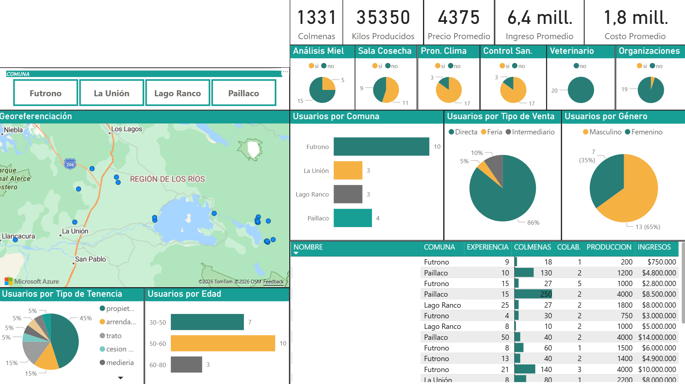

# 🐝 SAT Apícola Data Dashboard

> Dashboard de diagnóstico y análisis de datos para productores apícolas de la Región de Los Ríos.

## 📝 Objetivo
Transformar datos levantados en terreno en información útil para visualizar el diagnóstico inicial de productores de miel y apoyar la toma de decisiones de un profesional del área agrícola.

## 📖 Contexto
Este proyecto se desarrolló a partir de la necesidad de un profesional agrícola de contar con una herramienta que permitiera visualizar de forma clara el diagnóstico inicial de productores de miel en la Región de Los Ríos.

Los datos fueron obtenidos mediante entrevistas a productores y, posteriormente, sometidos a un proceso de limpieza, preparación y análisis para construir un dashboard orientado a la gestión.

El resultado permitió mostrar información clave como georreferenciación, diferencias por género, kilos producidos, costos e implementación de laboratorios, facilitando una lectura más precisa de la situación diagnóstica. El dashboard aportó valor al proceso al entregar conclusiones claras, visuales y sustentadas en datos confiables, mejorando la capacidad de análisis del profesional a cargo.

## 🎯 Problema
La información recolectada en terreno necesitaba ser procesada, limpiada y analizada para transformarse en una herramienta útil de diagnóstico. Sin una visualización adecuada, resultaba difícil identificar patrones, diferencias relevantes y conclusiones accionables.

## 💡 Solución Desarrollada
Se realizó un proceso *end-to-end* que incluyó:
- Limpieza y estructuración de datos.
- Validación de registros.
- Análisis exploratorio.
- Construcción de indicadores clave.
- Visualización territorial y demográfica.
- Diseño de dashboard orientado a diagnóstico.

## 🛠️ Herramientas Utilizadas
- **Microsoft Excel:** Almacenamiento inicial y tabulación.
- **Power Query:** Transformación y modelamiento de datos (ETL).
- **Power BI:** Visualización y desarrollo del dashboard.
- **Análisis de Datos:** Estadísticas descriptivas e inteligencia de negocios.

## 📊 KPIs e Indicadores Clave
- Total de colmenas.
- Kilos producidos.
- Precio promedio.
- Ingreso promedio.
- Costo promedio.
- Distribución por comuna.
- Georreferenciación de productores.
- Distribución por género.
- Distribución por edad.
- Tipo de tenencia.
- Tipo de venta.
- Implementación de laboratorios y condiciones técnicas.

## ❓ Preguntas que Ayudó a Responder
- ¿Dónde se concentran los productores diagnosticados?
- ¿Qué diferencias existen por género?
- ¿Qué niveles de producción e ingresos se observan?
- ¿Qué patrones se identifican por edad y tipo de tenencia?
- ¿Qué nivel de implementación técnica presentan los productores?

## 🔄 Flujo del Proyecto

## 👁️ Vista Previa del Proyecto

  

> **Nota:** La imagen fue adaptada para fines de portafolio y no expone información sensible ni datos identificables de productores.

## 📚 Documentación Adicional
- 🏢 [Contexto de negocio](docs/business-context.md)
- 🧹 [Proceso de limpieza de datos](docs/data-cleaning-process.md)
- 📈 [Insights e indicadores clave](docs/insights-and-kpis.md)

## ⚠️ Consideraciones
Este repositorio presenta una versión adaptada del caso real. **No se exponen datos sensibles ni información privada** de los productores encuestados.

## 📫 Contacto
Si quieres conocer más sobre este proyecto o mi trabajo en análisis de datos y automatización, puedes contactarme:
- 📧 **Email:** [claudio.duran.m@gmail.com](mailto:claudio.duran.m@gmail.com)
- 💼 **LinkedIn:** [Claudio Durán Molina](https://www.linkedin.com/in/claudio-duran-molina-41580677)
